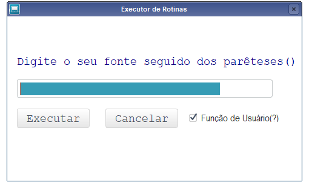
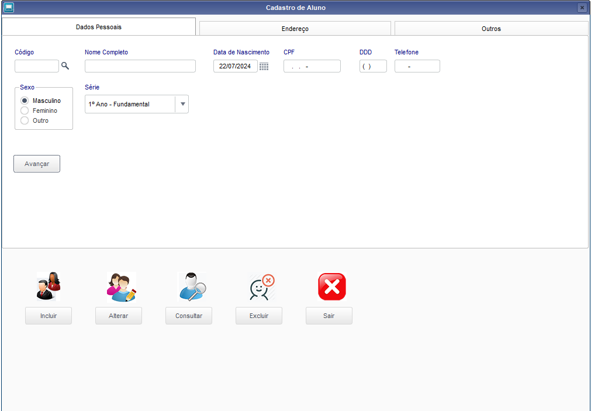

# Projetos em ADVPL/TL++

Este repositório foi criado com o objetivo de armazenar meus fontes criados durante meus estudos na linguagem ADVPL e Sistema ERP Protheus, bem como ser uma fonte de conhecimento para auxiliar no desenvolvimento de customizações futuras.

- [Executor de fontes: ](executorFontes.tlpp)  Criado para executar rotinas costumizadas pelo usuário e padrões do Protheus.

 - [Tela de Cadastro: ](CadastroAluno/projeto01.tlpp)  Interface de cadastro de alunos criada com elementos visuais do ADVPL, utiliza caixa de diálogo (TDialog) e pastas (TFolders) para organizar as seções da tela, como dados pessoais e endereço. Contando com validação de entrada dos dados, o fonte funciona como um CRUD de uma tabela personalizada de alunos. Suas principais funções incluem: cadastro, alteração, consultar e exclusão. É um exemplo prático de automação de processos administrativos utilizando AdvPL.

